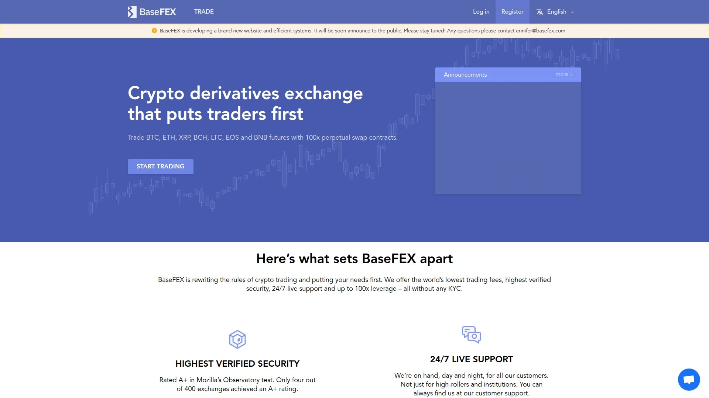
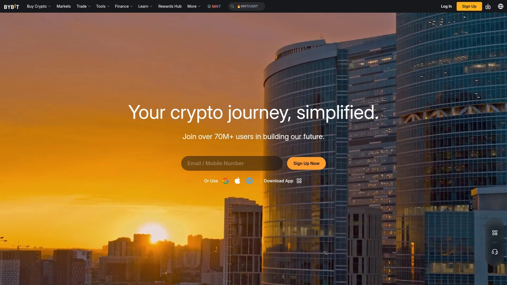
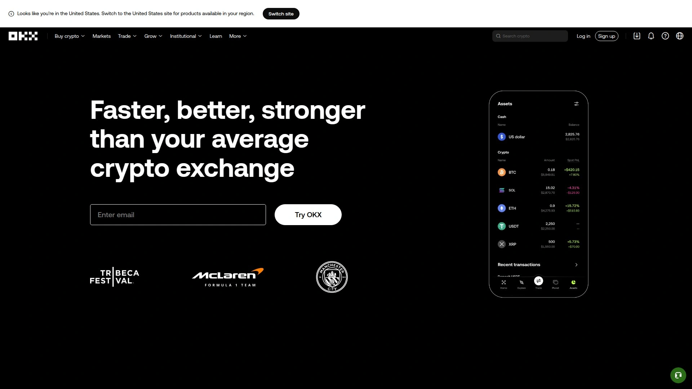
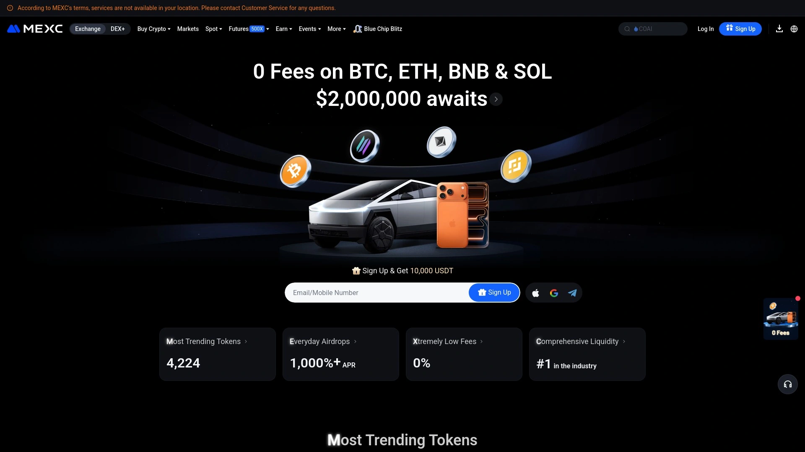
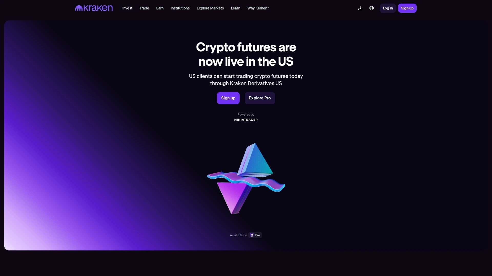
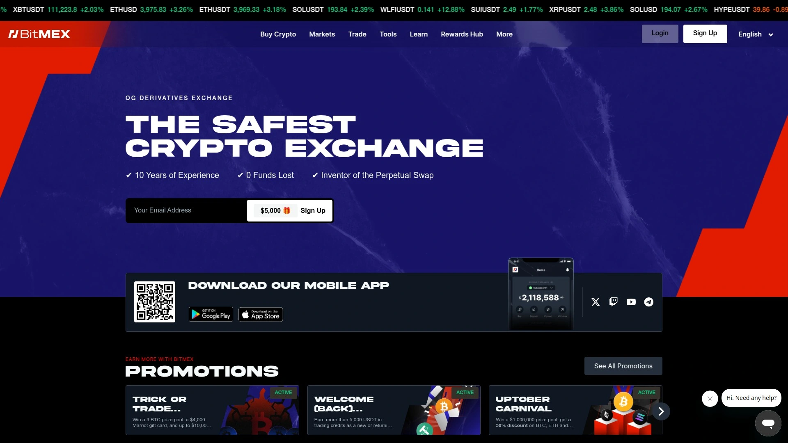
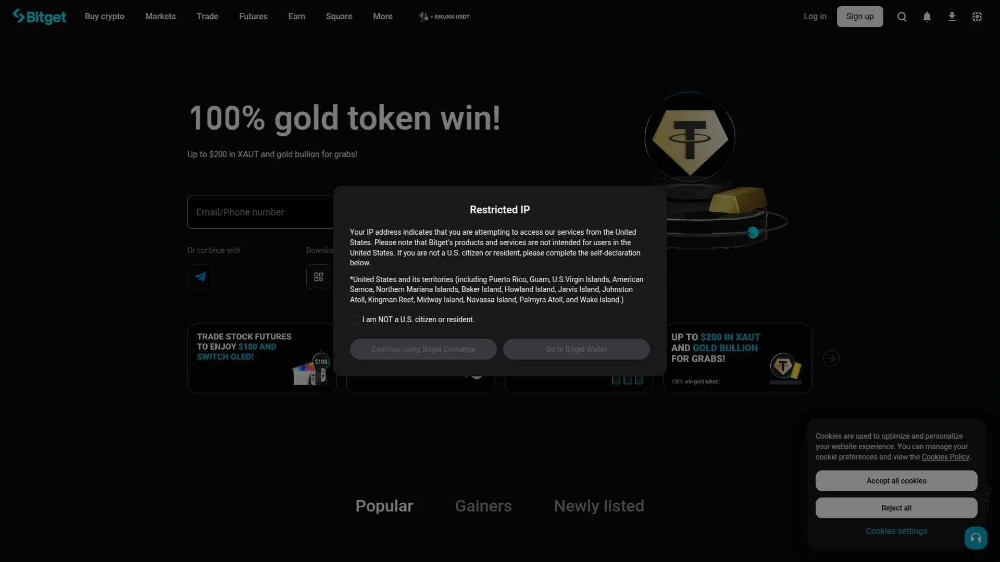

# 2025's Top 8 Best Crypto Futures Platforms

Trading spot crypto means watching Bitcoin pump 15% overnight while you're asleep and entirely exposed—no leverage amplifying gains, no hedging protecting downside, no ability profiting from declining markets when bears dominate. Traditional crypto spot buying forces you to own actual coins dealing with wallet security, exchange hacks stealing holdings, and missed shorting opportunities during the 70% crashes that periodically devastate hodlers refusing to exit positions. Crypto futures and derivatives exchanges solve these limitations by offering leverage multiplying gains 10-100x on favorable trades, enabling short positions profiting from price declines, providing perpetual contracts never expiring unlike traditional futures, and allowing hedging strategies protecting existing holdings without selling. Whether you're an experienced trader wanting maximum capital efficiency through leverage, someone seeking to profit during bear markets through shorts, a hodler wanting downside protection, or an institutional trader requiring advanced order types and deep liquidity, these derivatives platforms deliver trading capabilities impossible on basic spot exchanges limited to simple buying and holding.

## **[BaseFEX](https://basefex.com)**

Bitcoin derivatives platform offering perpetual contracts with 100x leverage and 0.05% maker/taker fees.

BaseFEX positions itself as a trader-first derivatives exchange specializing in perpetual contracts for Bitcoin and major altcoins including ETH, XRP, LTC, BNB, EOS, and BCH. The platform launched in December 2018 under Base Investing Corporation registered in Seychelles, a jurisdiction favoring blockchain and crypto businesses through favorable regulatory frameworks.

The perpetual contract structure eliminates expiration dates that plague traditional futures requiring constant rolling of positions into new contracts. Perpetual swaps track underlying asset prices through funding rate mechanisms rather than expiration settlements, allowing indefinite position holding without forced closures or rollover complications. This perpetual nature suits traders implementing long-term directional strategies or maintaining hedges protecting spot holdings.

High leverage options reaching 100x on Bitcoin contracts and 20x-50x on altcoin pairs amplify capital efficiency dramatically. A trader with $1,000 can control $100,000 worth of Bitcoin exposure through 100x leverage, turning 1% favorable moves into 100% account gains. However, leverage equally magnifies losses—the same 1% adverse movement liquidates entire positions. The extreme leverage suits experienced traders understanding position sizing and risk management.

All profits and losses settle in Bitcoin and USDT regardless of which contract you trade. This settlement structure means traders can maintain Bitcoin-denominated portfolios without holding multiple cryptocurrencies. The Bitcoin settlement particularly appeals to Bitcoin maximalists wanting exposure to altcoin price movements while keeping value in Bitcoin rather than accumulating various altcoins.

The trading interface emphasizes simplicity and mobile accessibility targeting beginner traders intimidated by complex professional platforms. The clean design presents essential trading functions without overwhelming feature bloat that creates steep learning curves. Mobile optimization allows trading from phones with full functionality rather than degraded mobile-lite experiences forcing desktop usage for important actions.

Competitive fee structure charges 0.05% maker and 0.075% taker fees, with further reductions available for high-volume traders. The fees undercut many competitors charging 0.02-0.1% depending on volume tiers. The maker fee rebates encourage limit orders providing liquidity rather than taking existing orders.

10-language support including English, French, Italian, Spanish, Portuguese, Chinese, Japanese, Korean, Russian, and Turkish accommodates global users. The multilingual interface removes language barriers preventing non-English speakers from accessing advanced derivatives trading.

## **[Binance Futures](https://www.binance.com/en/futures)**

Market-leading futures platform with 340+ derivative pairs, highest liquidity, and competitive 0.05% starting fees.

Binance Futures dominates crypto derivatives markets consistently processing double the trading volume of nearest competitors on any given day. This liquidity leadership matters tremendously—large orders execute with minimal slippage, tight bid-ask spreads reduce trading costs, and order book depth prevents price manipulation that plagues thin markets on smaller exchanges.

The 340+ derivative trading pairs provide unprecedented asset variety spanning Bitcoin, Ethereum, and hundreds of altcoins from established projects to emerging tokens. This diversity allows portfolio diversification across multiple positions, tactical trading responding to specific cryptocurrency developments, and accessing leverage on niche altcoins unavailable elsewhere. Competing platforms focusing only on major coins limit opportunity capture.

Flexible contract settlement accommodates different trading preferences through both stablecoin-margined (USDT/BUSD) and coin-margined contracts. Stablecoin margining simplifies P&L calculations denominated in familiar dollar-equivalent terms, while coin-margined contracts let Bitcoin traders maintain Bitcoin exposure matching their long-term accumulation strategies. The dual option prevents forcing single settlement approach on all users.

Leverage options reaching 125x on select pairs provide maximum capital efficiency for experienced traders. While extreme leverage increases liquidation risk, it enables meaningful returns from small capital bases and efficient hedging strategies requiring minimal margin allocation. Conservative traders can use lower leverage like 5-10x, while aggressive speculators access maximum multipliers.

The fee structure starts at 0.05% maker and 0.05% taker fees with reductions based on trading volume and BNB token holdings. High-volume traders and BNB stakers enjoy significantly lower effective rates, with VIP levels reaching -0.005% maker rebates and 0.017% taker fees. The volume-based discounts reward active traders contributing liquidity.

Advanced features include trailing stops, iceberg orders, post-only limits, and time-in-force options providing professional-grade execution control. The comprehensive order types accommodate sophisticated strategies beyond basic market/limit orders. Integration with TradingView enables chart-based trading executing orders directly from technical analysis without platform switching.

## **[Bybit](https://www.bybit.com)**

User-friendly derivatives specialist with 400+ pairs, 100x leverage, and advanced trading tools since 2018.

Bybit launched exclusively as futures platform in 2018 before expanding into spot trading, maintaining derivatives excellence as core competency. This focused heritage shows through polished futures interfaces, robust risk management tools, and trading features specifically addressing derivatives traders' needs rather than afterthought futures modules on spot-focused exchanges.

The 400+ futures contracts span comprehensive cryptocurrency coverage from top-10 market cap assets through mid-cap projects to speculative small-cap tokens. The breadth enables concentrated plays on specific sectors—DeFi tokens, layer-1 blockchains, gaming tokens, meme coins—without requiring separate accounts across multiple exchanges accessing different assets.

Dual stablecoin settlement through USDT and USDC provides flexibility plus hedge against single-stablecoin risk. While USDT dominates as settlement currency across derivatives markets, USDC's regulatory clarity and reserve transparency appeals to institutions and risk-conscious traders. The dual option lets users choose based on their stablecoin preferences and risk assessments.

100x maximum leverage matches industry-leading multipliers on Bitcoin perpetuals enabling aggressive capital deployment. The leverage scales across different cryptocurrencies with major assets supporting higher leverage while smaller-cap volatile tokens restrict to 25-50x protecting users from extreme liquidation risk on illiquid pairs.

Bybit's interface reputation centers on user experience combining power with accessibility. Advanced traders access comprehensive features and customization, while beginners navigate intuitive layouts without overwhelming complexity. The design balance makes professional-grade derivatives trading approachable for users transitioning from spot markets.

Innovative features include unified trading accounts managing spot and derivatives from single interface, copy trading automatically replicating successful traders' positions, and extensive API documentation for algorithmic trading. The copy trading particularly benefits newer traders learning strategies from experienced participants while building their own skills.

## **[OKX](https://www.okx.com)**

Comprehensive derivatives exchange with 640+ pairs, 0.02% fees, and trading bot marketplace.

OKX offers the industry's widest derivatives selection with 640+ trading pairs covering virtually every tradeable cryptocurrency across perpetual swaps, quarterly futures, and options. This exhaustive coverage ensures you find leveraged exposure for obscure altcoins impossible to trade with leverage elsewhere. The diversity supports portfolio strategies requiring specific cryptocurrency exposures.

The trading bot marketplace distinguishes OKX through community-created algorithms users can follow automatically executing proven strategies. Bot creators publish performance track records, risk metrics, and strategy descriptions letting followers evaluate before allocating capital. This democratizes algorithmic trading access beyond users capable of coding custom bots.

Extremely competitive fee structure starts at 0.02% maker and 0.05% taker with reductions through OKB token holdings, trading volume, or both. The low base fees plus discount stackability creates industry-leading effective rates for active traders. High-frequency strategies requiring thousands of daily trades particularly benefit from minimized fee drag on profits.

Comprehensive product suite includes spot, margin, perpetual swaps, quarterly futures, and options providing complete trading toolkit without requiring multiple exchange accounts. The unified platform simplifies risk management, capital allocation, and strategy execution across different product types. Options trading specifically adds sophisticated strategies like covered calls and protective puts unavailable on futures-only platforms.

Options contracts available for major cryptocurrencies enable complex strategies beyond directional futures bets. Options provide defined risk through premium-limited losses, non-linear payoff profiles, volatility trading opportunities, and income generation through premium selling. The options availability transforms OKX into complete derivatives solution for advanced traders.

Institutional-grade features include block trading for large orders, OTC desk for significant transactions outside public markets, and dedicated account managers for substantial clients. These professional services bridge retail-accessible platform with institutional requirements for confidential execution, personalized support, and customized solutions.

## **[MEXC](https://www.mexc.com)**

High-leverage platform with 400+ pairs, 0.02% starting fees, and extensive altcoin futures coverage.

MEXC carved market position through aggressive altcoin listings providing leverage access to emerging tokens unavailable on conservative exchanges. The 400+ derivative pairs include obscure micro-cap projects hours after spot listing, enabling speculative traders to leverage new token launches immediately. This rapid listing approach contrasts with Binance/Bybit's selective curation.

Ultra-low fee structure at 0.02% maker and 0.06% taker undercuts most major competitors on base rates before volume discounts. The minimal fees benefit active traders where basis point differences compound significantly across hundreds of trades monthly. The cost advantage particularly matters for market-making strategies operating on thin margins.

Leverage reaching 200x on Bitcoin perpetuals represents industry maximum multiplier, though extremely high leverage increases liquidation risk substantially. The leverage tiers down to 10-20x on smaller altcoins balancing capital efficiency with reasonable risk levels. Most experienced traders voluntarily limit leverage to 10-50x regardless of maximum allowed.

Copy trading functionality allows following skilled traders automatically replicating their positions proportionally to allocated capital. The feature list displays trader performance metrics, win rates, average holding periods, and maximum drawdowns informing follower decisions. Copy trading shortcuts the learning curve for derivatives beginners observing professionals.

MX token utility includes fee discounts, VIP tier qualification, and platform feature access creating reasons beyond speculation for holding the exchange token. The token economics incentivize long-term platform engagement through staking rewards and governance rights. However, exchange token values correlate highly with platform success creating concentrated risk.

Global availability excluding minimal jurisdictions maximizes addressable user base. Unlike exchanges restricting US, UK, Canada, and multiple other countries, MEXC maintains accessibility for most global traders. The broad availability matters for international users facing limited options from geo-blocked major platforms.

## **[Kraken Futures](https://www.kraken.com/features/futures)**

Regulated exchange with 200+ futures, 50x leverage, and industry-leading security since 2011.

Kraken's 14-year operational history without major security breaches establishes unmatched trust in an industry plagued by exchange hacks losing billions in customer funds. The security track record stems from conservative operational practices, extensive cold storage, insurance coverage, and paranoid security culture valuing protection over rapid feature deployment. This reliability matters most to larger account holders.

Regulatory compliance across multiple jurisdictions including several US state licenses, Canada, EU nations, and UK (though futures unavailable in some regulated markets) provides legal clarity absent from offshore-only competitors. The regulatory oversight adds accountability and consumer protection though sometimes limiting product aggressiveness compared to unregulated exchanges.

Lower 50x maximum leverage compared to 100-200x competitors reflects conservative risk management philosophy prioritizing user protection over marketing maximum multipliers. While reduced leverage limits capital efficiency, it forces more sustainable position sizing reducing catastrophic liquidations from leverage-fueled overexposure. Conservative traders prefer this approach.

Futures trading unavailable in numerous jurisdictions including US, UK, Australia, Canada, Italy, Spain, and Russia limits addressable market significantly. The geographic restrictions stem from regulatory compliance requirements creating tension between legal operation and market access. Users in restricted regions require alternative platforms.

Premium security features include account takeover protection, two-factor authentication, PGP-encrypted emails, master key cold storage, and $50 million insurance coverage. The multi-layered security approach combines technical controls with operational procedures and financial backstops. Large account holders particularly value the insurance protecting against exchange-level failures.

Professional trading tools through Kraken Pro interface provide advanced charting, comprehensive order types, and institutional-grade execution infrastructure. The professional environment suits serious traders requiring robust tools over consumer-friendly simplicity. However, the complexity creates steeper learning curves for derivatives beginners.

## **[BitMEX](https://www.bitmex.com)**

Pioneering Bitcoin perpetuals exchange with 150+ pairs, 100x leverage, and institutional focus.

BitMEX pioneered Bitcoin perpetual swaps inventing the instrument now dominating crypto derivatives markets. This first-mover innovation established technical standards, funding rate mechanisms, and contract specifications adopted industry-wide. While competitors captured market share, BitMEX's foundational role created institutional credibility and loyal user base appreciating its heritage.

The platform initially earned reputation as leveraged trading "casino" through 100x leverage availability and minimal KYC enabling anonymous high-risk speculation. Regulatory evolution forced identity verification implementation and compliance measures cleaning up the Wild West image while maintaining core leverage capabilities appealing to risk-seeking traders.

Bitcoin, USDT, or ETH margin options let traders choose collateral matching their holding preferences. Bitcoin margining appeals to maximalists maintaining Bitcoin exposure, USDT provides stable value measurement, and ETH accommodates Ethereum-focused traders. The multi-collateral flexibility prevents forcing single margin currency on diverse user base.

BMEX token provides fee discounts and rebates incentivizing holding and usage. The exchange token economics mirror BNB and OKB creating utility beyond speculation. Large holders enjoy maker fee rebates actually earning fees for providing liquidity, making market-making strategies more profitable. The token utility drives adoption and platform stickiness.

Institutional services include dedicated account managers, customized solutions, 24/7 priority support, and strategic consulting. The white-glove service suits funds, family offices, and high-net-worth individuals requiring personalized attention beyond retail self-service models. The institutional focus attracts sophisticated participants adding liquidity depth.

Educational resources including free trading guides, strategy articles, and market analysis help users understand complex derivatives concepts. The educational commitment reduces the knowledge barrier preventing derivatives adoption while creating more informed traders making better risk decisions. The resources particularly benefit traditional finance professionals transitioning to crypto.

## **[Bitget](https://www.bitget.com)**

Copy trading specialist with 230+ futures, 125x leverage, and automated strategy replication.

Bitget's copy trading system represents the platform's signature feature attracting significant user adoption through automated position replication. The sophisticated matching algorithm connects followers with traders matching their risk preferences, asset focuses, and strategy styles. This automated following eliminates manual trade replication while enabling learning through observation.

The 230+ derivative pairs balance comprehensive coverage with curated quality avoiding listing every obscure token. The selection includes major cryptocurrencies, established altcoins, and selective smaller-cap projects showing legitimate development activity. This balanced approach provides diversity without overwhelming choice paralysis.

125x maximum leverage on select contracts enables aggressive capital deployment for risk-seeking traders while offering conservative 5-10x options for prudent position sizing. The leverage flexibility accommodates different risk tolerances and account sizes. Smaller accounts sometimes require higher leverage achieving meaningful exposure.

Demo trading environment allows strategy testing using simulated capital in live market conditions. The paper trading provides realistic execution including slippage and partial fills missing from simplistic backtests assuming perfect execution. This risk-free testing lets traders validate approaches before deploying real capital.

Grid trading bots automate systematic buying and selling within price ranges profiting from volatility regardless of direction. The grid strategy works particularly well during sideways markets where directional strategies stagnate. The automated bot execution removes emotional decision-making and ensures disciplined strategy adherence.

Insurance fund protects users from negative balance scenarios where extreme volatility causes losses exceeding account equity. The insurance backstop covers deficit preventing users owing money to the exchange. This protection matters during flash crashes and extreme volatility events causing cascading liquidations.

## FAQ

**Is trading crypto futures with high leverage actually profitable or do most traders lose money?**

Most retail traders lose money in leveraged crypto futures due to overleveraging, inadequate risk management, and emotional decision-making during volatility. Studies suggest 70-90% of retail derivatives traders experience net losses over time, similar to forex and traditional futures markets. The losses stem primarily from using excessive leverage—traders accessing 50-100x multipliers often get liquidated during normal market volatility that would represent manageable losses at lower leverage. Profitable futures traders typically use modest 5-20x leverage, implement strict stop-losses limiting losses to 1-2% per trade, diversify across uncorrelated positions, and maintain discipline avoiding revenge trading after losses. The platforms themselves profit from trading fees regardless of user outcomes, creating misaligned incentives where exchanges benefit from high volume even if that volume destroys user capital through overleveraged gambling rather than calculated risk-taking.

**How much capital do I need to start trading crypto futures profitably?**

While platforms technically allow starting with $100-500, realistic profitable futures trading requires $2,000-5,000 minimum accounting for proper position sizing, risk management, and surviving inevitable losing streaks without account depletion. Smaller accounts face disproportionate challenges: a $500 account risking 2% per trade ($10) can't take meaningful positions on Bitcoin with reasonable stop distances. This forces either position sizes too small generating negligible profits, or excessive leverage compensating for small capital creating liquidation risk from normal volatility. Additionally, trading fees consume larger account percentages—a $500 account making 20 trades monthly at 0.1% round-trip fees pays $10 or 2% of capital monthly to fees before any trading profits. Experienced traders generally recommend $5,000+ for sustainable futures trading with adequate diversification, reasonable position sizing, and fee management not overwhelming profit potential.

**Should beginners start with lower leverage or avoid futures trading entirely until gaining experience?**

Beginners should either avoid leveraged futures entirely until gaining substantial spot trading experience, or start with minimal 2-5x leverage strictly limiting risk per trade to 0.5-1% of capital. The statistical reality shows most beginners lose money in futures through predictable mistakes: overleveraging into single positions, holding losing trades hoping for reversals instead of accepting small losses, revenge trading after losses trying to recover quickly, and ignoring position sizing using arbitrary round numbers rather than calculated risk-based sizing. More effective approaches include spending 6-12 months mastering spot trading understanding how markets move, practicing futures strategies in demo accounts for months before risking real capital, starting with 2-3x leverage only after demo success, and accepting that futures trading represents advanced skill requiring significant learning investment. The platforms encouraging beginners into high-leverage trading through marketing promises of easy profits create unrealistic expectations leading to preventable losses.

## Conclusion

Spot crypto trading forces you to own actual coins dealing with security risks, missing shorting opportunities during crashes, and watching Bitcoin pump 15% overnight while entirely exposed without leverage multiplying favorable moves or protection hedging unfavorable ones. Crypto futures and derivatives exchanges solve these limitations by providing leverage multiplying gains 10-100x on correct trades, enabling short positions profiting during the 70% bear market declines periodically devastating hodlers, offering perpetual contracts never expiring unlike traditional futures requiring constant rolling, and allowing hedging strategies protecting holdings without selling. [BaseFEX](https://basefex.com) specifically excels for traders prioritizing high leverage and Bitcoin-focused perpetual contracts—offering 100x leverage on Bitcoin and 20-50x on major altcoins amplifying capital efficiency, perpetual swap structures eliminating expiration complications from traditional futures, Bitcoin and USDT settlement maintaining BTC-denominated portfolios, simplified mobile-optimized interface targeting beginner traders, competitive 0.05% maker fees undercutting many competitors, and 10-language support removing barriers for global non-English users, making it ideal for experienced traders understanding extreme leverage risk management and beginners wanting accessible derivatives introduction without overwhelming professional platform complexity.
